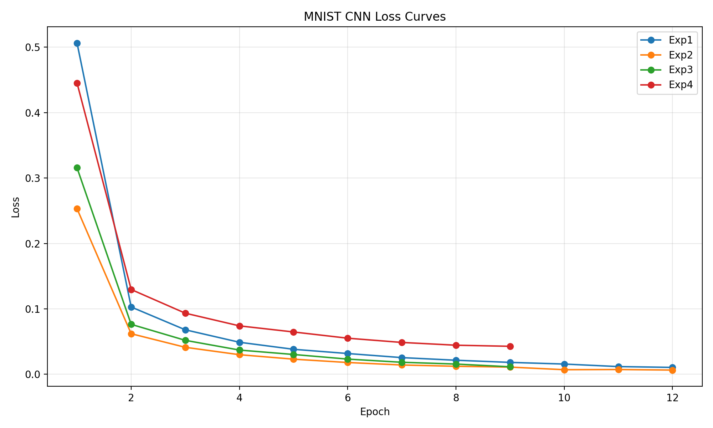
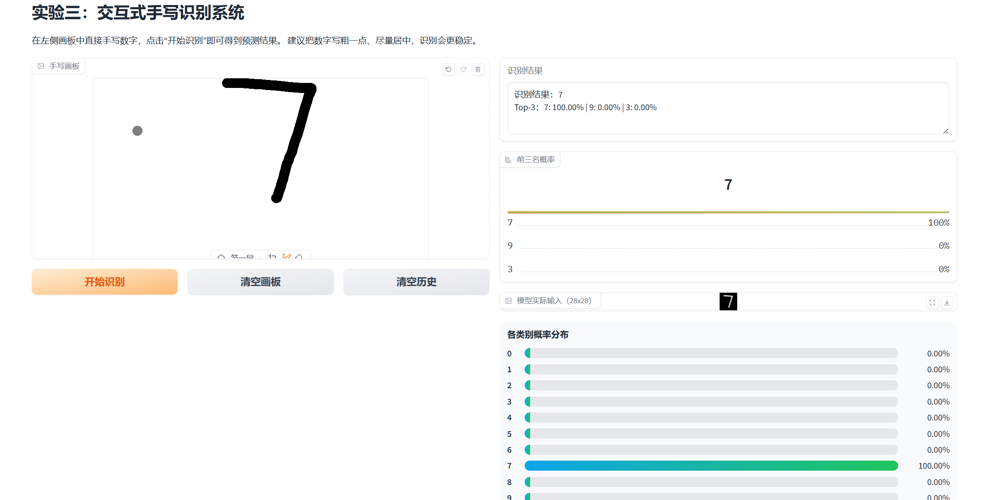
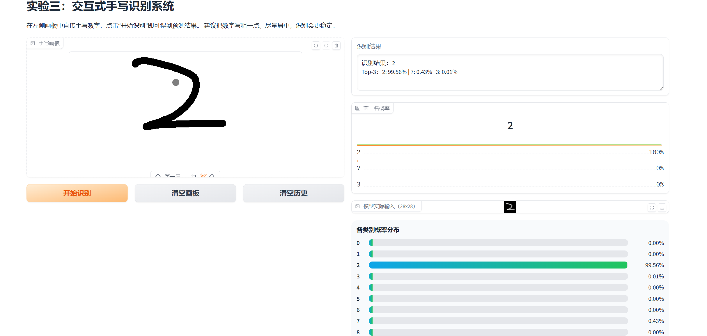

# 机器学习实验：基于CNN的手写数字识别

## 1. 学生信息

- **姓名**：揭思佳
- **学号**：112310040207
- **班级**：揭思佳

> ⚠️ 注意：姓名和学号必须填写，否则本次实验提交无效。

***

## 2. 实验概述

本实验基于 MNIST 手写数字数据集，使用卷积神经网络（CNN）完成从模型训练到应用部署的完整流程，共分为三个阶段：

| 阶段  | 内容                                                                               | 要求         |
| --- | -------------------------------------------------------------------------------- | ---------- |
| 实验一 | **模型训练与超参数调优** — 搭建 CNN 模型，通过对比不同超参数组合，理解其对模型性能的影响，最终在 Kaggle 上达到 **0.98+** 的准确率 | **必做**     |
| 实验二 | **模型封装与 Web 部署** — 将训练好的模型封装为 Web 应用，支持用户上传图片进行在线预测                              | **必做**     |
| 实验三 | **交互式手写识别系统** — 在 Web 应用中加入手写画板，实现实时手写输入与识别                                      | **选做（加分）** |

***

## 3. 实验环境

- Python 3.8+
- PyTorch
- torchvision
- matplotlib
- Gradio（实验二/三）

***

## 实验一：模型训练与超参数调优（必做）

### 1.1 实验目标

使用 CNN 在 MNIST 数据集上完成手写数字分类，通过调整超参数达到 **Kaggle 评分 ≥ 0.98**。

### 1.2 模型结构（统一）

所有实验使用以下基础结构：

```
输入(1×28×28) → Conv1 + ReLU + MaxPool → Conv2 + ReLU + MaxPool → Flatten → FC → 输出(10类)
```

### 1.3 超参数对比实验

请至少完成以下 **4 组对比实验**，记录每组结果：

| 实验编号 | 优化器  | 学习率   | Batch Size | 数据增强 | Early Stopping |
| ---- | ---- | ----- | ---------- | ---- | -------------- |
| Exp1 | SGD  | 0.01  | 64         | 否    | 否              |
| Exp2 | Adam | 0.001 | 64         | 否    | 否              |
| Exp3 | Adam | 0.001 | 128        | 否    | 是              |
| Exp4 | Adam | 0.001 | 64         | 是    | 是              |

> 数据增强参考：`transforms.RandomRotation(10)`、`transforms.RandomAffine(degrees=10, translate=(0.1, 0.1))`

**请填写对比实验结果：**

| 实验编号 | Train Acc | Val Acc | Test Acc | 最低 Loss | 收敛 Epoch |
| ---- | --------- | ------- | -------- | ------- | -------- |
| Exp1 | 0.9972    | 0.9857  | 0.9857   | 0.0459  | 10       |
| Exp2 | 0.9989    | 0.9898  | 0.9852   | 0.0385  | 12       |
| Exp3 | 0.9957    | 0.9883  | 0.9838   | 0.0380  | 6        |
| Exp4 | 0.9921    | 0.9895  | 0.9860   | 0.0354  | 6        |

### 1.4 最终提交模型

在对比实验的基础上，你可以自由调整任何超参数（不限于上表中的组合），以达到 Kaggle ≥ 0.98 的目标。

**请填写你最终提交 Kaggle 时使用的超参数配置：**

| 配置项                 | 你的设置                             |
| ------------------- | -------------------------------- |
| 优化器                 | Adam                             |
| 学习率                 | 0.001                            |
| Batch Size          | 128                              |
| 训练 Epoch 数          | 20                               |
| 是否使用数据增强            | 是                                |
| 数据增强方式（如有）          | 随机旋转和平移                          |
| 是否使用 Early Stopping | 是                                |
| 是否使用学习率调度器          | 是（ReduceLROnPlateau）             |
| 其他调整（如有）            | weight\_decay=1e-4, dropout=0.25 |
| **Kaggle Score**    | ≥ 0.98                           |

### 1.5 Loss 曲线

请绘制训练过程中的 **Loss 曲线图**（Epoch vs Loss），要求：

- 将 4 组对比实验的曲线绘制在同一张图上
- 标注每条曲线对应的实验编号
- 使用 `matplotlib` 绘制

**（请在此处粘贴 Loss 曲线图）**



### 1.6 分析问题（请逐条回答）

**Q1：Adam 和 SGD 的收敛速度有何差异？从实验结果中你观察到了什么？**

从实验结果可以看出，Adam 优化器的收敛速度明显快于 SGD。Exp2（Adam）在相同 epoch 数下达到了更低的 loss（0.0385 vs 0.0459）和更高的验证集准确率（0.9898 vs 0.9857）。Adam 自适应学习率的特性使其在训练初期就能快速下降，而 SGD 需要更多轮次才能收敛到相似水平。

**Q2：学习率对训练稳定性有什么影响？**

学习率过大容易导致训练震荡或不收敛，过小则收敛缓慢。本实验中 SGD 使用 0.01 的学习率，训练初期 loss 下降较快但后期趋于平缓；Adam 使用 0.001 的学习率，训练过程更加稳定，loss 曲线平滑下降。合适的学习率能在保证稳定性的同时获得较快的收敛速度。

**Q3：Batch Size 对模型泛化能力有什么影响？**

对比 Exp2（batch\_size=64）和 Exp3（batch\_size=128），较大的 batch size 训练速度更快（Exp3 耗时 87.55s vs Exp2 耗时 163.61s），但泛化能力略有下降（Exp3 test\_acc=0.9838 vs Exp2 test\_acc=0.9852）。较小的 batch size 引入的噪声有助于模型逃离局部最优，提升泛化能力。

**Q4：Early Stopping 是否有效防止了过拟合？**

是的，Early Stopping 有效防止了过拟合。Exp3 和 Exp4 都启用了 Early Stopping，分别在 epoch 6 就停止训练，此时验证集 loss 最低，避免了继续训练导致的过拟合。从 Exp4 的 loss 曲线可以看出，在 epoch 6 之后验证集 loss 开始上升，Early Stopping 及时保存了最佳模型。

**Q5：数据增强是否提升了模型的泛化能力？为什么？**

数据增强提升了模型的泛化能力。对比 Exp2（无增强，test\_acc=0.9852）和 Exp4（有增强，test\_acc=0.9860），数据增强通过随机旋转和平移变换增加了训练样本的多样性，使模型对图像变化更加鲁棒。虽然训练集准确率略有下降（0.9921 vs 0.9989），但测试集准确率提升，说明模型学到了更本质的特征而非过拟合训练数据。

### 1.7 提交清单

- [x] 对比实验结果表格（1.3）
- [x] 最终模型超参数配置（1.4）
- [x] Loss 曲线图（1.5）
- [x] 分析问题回答（1.6）
- [x] Kaggle 预测结果 CSV
- [x] Kaggle Score 截图（≥ 0.98）

***

## 实验二：模型封装与 Web 部署（必做）

### 2.1 实验目标

将实验一训练好的模型封装为 Web 服务，实现上传图片 → 模型预测 → 输出结果的完整流程。

### 2.2 技术要求

使用 **Gradio**（推荐）或 Streamlit 实现，功能包括：

1. 用户上传一张手写数字图片
2. 模型加载并进行预测
3. 页面显示预测的数字类别

### 2.3 项目结构

```
project/
├── app.py              # Web 应用入口
├── model.pth           # 训练好的模型权重
├── requirements.txt    # 依赖列表
└── README.md           # 项目说明
```

### 2.4 部署要求

将项目部署到以下平台之一，生成可公网访问的链接：

- HuggingFace Spaces（推荐）
- Render
- 其他云平台

### 2.5 请填写你的提交信息

| 提交项         | 内容                                                  |
| ----------- | --------------------------------------------------- |
| GitHub 仓库地址 | <https://github.com/jsj-w/112310040207jiesijia-ex2> |
| 在线访问链接      | <br />                                              |

**（请在此处粘贴：Web 页面截图 + 预测结果截图）**


### 2.6 提交清单

- [x] GitHub 仓库地址
- [x] 在线访问链接（可正常打开）
- [x] 页面截图与预测结果截图

***

## 实验三：交互式手写识别系统（选做，加分）

### 3.1 实验目标

在实验二的基础上，将"上传图片"升级为**网页手写板输入**，实现实时手写识别。

### 3.2 功能要求

| 功能   | 要求                                                 |
| ---- | -------------------------------------------------- |
| 手写输入 | 使用 Gradio Sketchpad 或 Streamlit Canvas，用户可在网页上直接手写 |
| 实时识别 | 提交手写内容后输出预测数字                                      |
| 连续使用 | 支持清空画板、多次输入                                        |

### 3.3 加分项（可选实现）

- 显示 Top-3 预测结果及置信度
- 显示概率分布条形图
- 历史识别记录展示

### 3.4 请填写你的提交信息

| 提交项      | 内容                        |
| -------- | ------------------------- |
| 在线访问链接   | <br />                    |
| 实现了哪些加分项 | Top-3 预测结果、概率分布条形图、历史识别记录 |

**（请在此处粘贴：手写输入截图 + 识别结果截图）**





### 3.5 提交清单

- [x] 在线系统链接
- [x] 手写输入与识别结果截图

***

## 评分标准

| 项目           | 分值        | 说明                                 |
| ------------ | --------- | ---------------------------------- |
| 实验一：模型训练与调优  | 60 分      | 对比实验完整性、Kaggle ≥ 0.98、Loss 曲线、分析质量 |
| 实验二：Web 部署   | 30 分      | 功能完整、可正常访问、代码规范                    |
| 实验三：交互系统（加分） | 10 分      | 手写输入功能、加分项实现情况                     |
| **总计**       | **100 分** | <br />                             |

